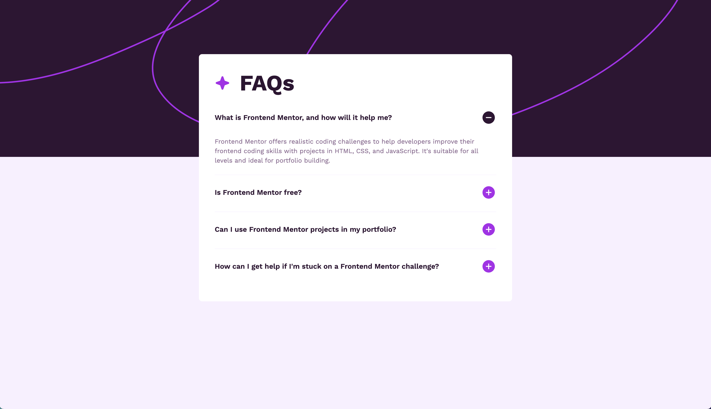

# Frontend Mentor FAQ Accordion Challenge

## Screenshot

## Built with

- Semantic HTML5 markup
- CSS custom properties
- Flexbox
- Mobile-first workflow
- Vanilla JavaScript

## Links

- [See live site here](https://thomaserdmenger.github.io/FAQ-accordion)
- [GitHub Repository](https://github.com/thomaserdmenger/FAQ-accordion)
- [GitHub Author](https://github.com/thomaserdmenger)
- [LinkedIn Author](https://www.linkedin.com/in/thomaserdmenger/)